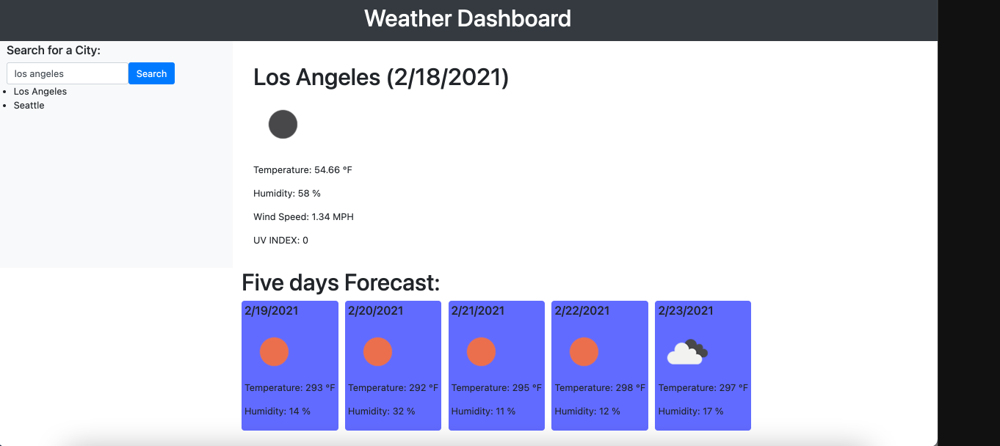
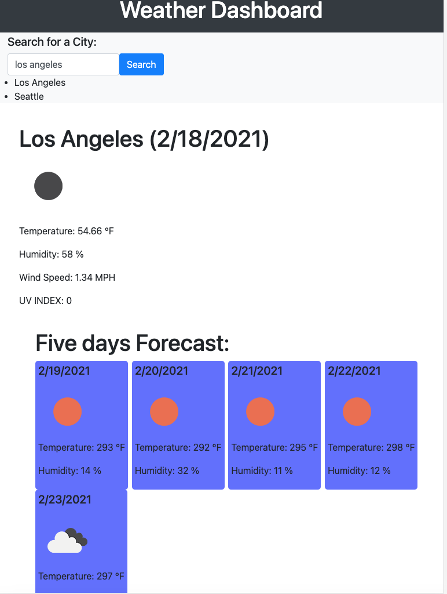

# Weather-API

# Weather Dashboard Application

## About this project

This application shows the weather for current day and next 5 days based on the user input city. It uses OpenWeatherApi to get the data to display.

## Screenshots of the application

### How to use?
- GIVEN a weather dashboard with form inputs
- WHEN I search for a city
-THEN I am presented with current and future conditions for that city and that city is added to the search history
- WHEN I view current weather conditions for that city
- THEN I am presented with the city name, the date, an icon representation of weather conditions, the temperature, the humidity, the wind speed, and the UV index
- WHEN I view the UV index
- THEN I am presented with a color that indicates whether the conditions are favorable, moderate, or severe
- WHEN I view future weather conditions for that city
- THEN I am presented with a 5-day forecast that displays the date, an icon representation of weather conditions, the temperature, and the humidity
- WHEN I click on a city in the search history
- THEN I am again presented with current and future conditions for that city

## Credits:
* List of the resources used to complete this project:
    * - [Bootstrap](https://getbootstrap.com/)
    * - [W3Schools](https://www.w3schools.com/) 
    * - [Git Hub](https://github.com/)
    * - [OpenWeather API](https://openweathermap.org/api)

##### Contributors:

* corobcenco.sandu@gmail.com
* [Sandu Corobcenco](https://github.com/SanduCorobcenco)
##### Directory:
* [Current Repository](https://github.com/SanduCorobcenco/Weather_Dashboard)
* [Website](https://sanducorobcenco.github.io/Weather_Dashboard/)
